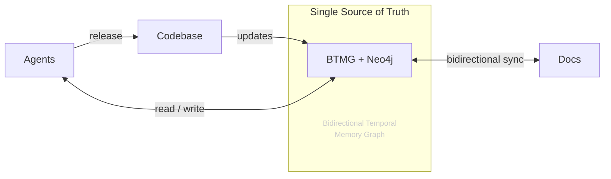
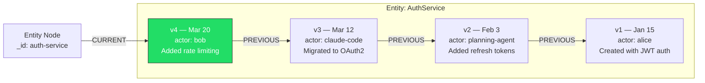
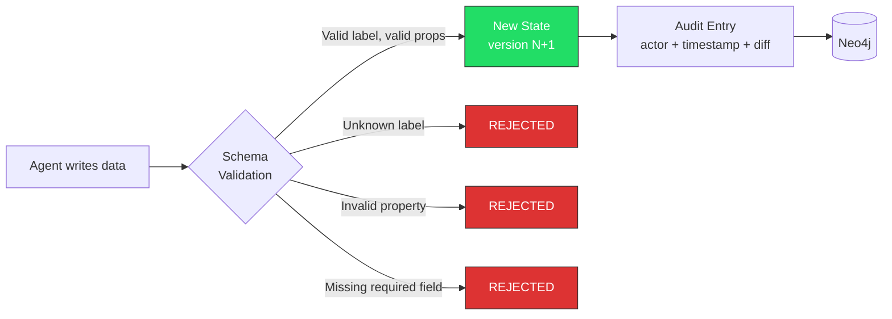
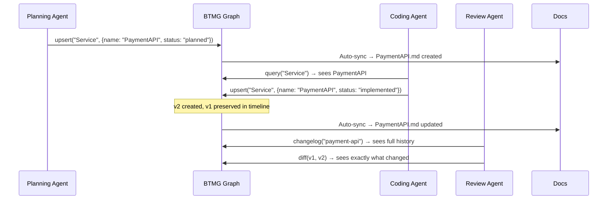
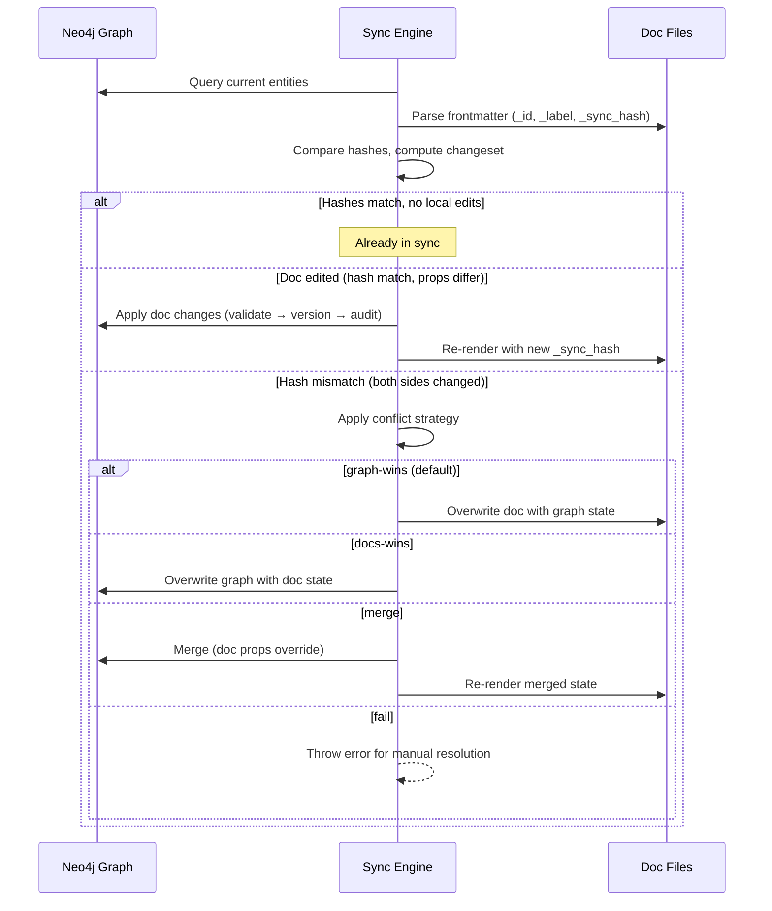

# BTMG — Bidirectional Temporal Memory Graph

A single source of truth between your documentation and every AI agent in your stack.

## The Problem

You have multiple AI agents — coding assistants, planning agents, review bots, A2A workflows — and they all need to understand your system: the architecture, the decisions made, what changed and when. But context is fragmented. Docs go stale. Agents hallucinate structure that doesn't exist. One agent updates something, the others don't know. There's no shared memory.

## What BTMG Does

BTMG is a knowledge graph that sits between your documentation and your agents. It enforces a schema (so agents can't hallucinate invalid structure), tracks every change on a temporal timeline (so any agent can know _what_ changed, _when_, and _by whom_), and syncs bidirectionally with your docs (so the graph and documentation are always the same thing).

Any agent can connect — via MCP, API, or CLI — read the current state, write changes, and every other agent sees it immediately. Your docs update automatically. Your docs change? The graph updates automatically.



The **codebase** sits at the top — it's the project you're building. As it changes, it updates the single source of truth: **BTMG + Neo4j** in the center. This is a temporal knowledge graph that tracks every component, every change, every decision — with a full timeline of who did what and when.

**Agents** sit around it. They read from it to stay context-aware, write to it as they work, and release code back into the codebase. They never need to re-read the entire codebase to understand what happened — the graph already knows. When agents discuss in A2A workflows, they share this as common memory.

**Documentation** sits on the other side, kept in bidirectional sync. When the graph updates, docs update. When docs are edited, the graph updates. The codebase can also update docs directly. This means you never manually maintain a thousand documents — the source of truth handles it.

The temporal dimension is what makes this powerful. Every entity has a version timeline — agents know at the component level what was changed, when, by whom, and why. They don't lose context between sessions. They don't hallucinate outdated state. They always work from the latest truth.


## Core Concepts

### Single Source of Truth

The graph IS the documentation and the documentation IS the graph. They are the same data, represented two ways. When an agent upserts a node, the corresponding doc file updates. When a human edits a doc, the graph updates on sync. A deterministic `_sync_hash` in each doc's frontmatter detects conflicts.

### Temporal Timeline (the Z-axis of time)

Every entity has a version chain. Not just "current state" but a complete timeline — you can query any entity at any point in time. This is the Z-index: at the component level, you know exactly what was updated, when, and by whom.



Any agent can ask: "What did the auth service look like on Feb 10?" and get the exact state at that point. This means:

- Agents are **context-aware** of everything done previously
- You get a full **audit trail** — every mutation logged with actor, timestamp, and diff
- **Point-in-time snapshots** let you reconstruct the entire graph at any moment

### Schema Enforcement (Anti-Hallucination)

Agents can't write arbitrary data. Every write passes through Zod validators compiled from your schema definition. Unknown labels, invalid property types, or missing required fields are rejected before they hit the database.



### Shared Memory for A2A

In agent-to-agent workflows, BTMG acts as common memory. Agent A updates the architecture graph, Agent B immediately sees it. No message passing, no stale context — they all read and write to the same temporal graph.



### Bidirectional Sync



## Prerequisites

### Neo4j

BTMG requires a running Neo4j instance (v5+). Pick whichever method works for you:

**Docker (recommended for dev):**

```bash
docker run -d \
  --name btmg-neo4j \
  -p 7474:7474 -p 7687:7687 \
  -e NEO4J_AUTH=neo4j/password \
  neo4j:5
```

**Neo4j Desktop:** Download from [neo4j.com/download](https://neo4j.com/download/), create a local database.

**Neo4j Aura (cloud):** Free tier at [neo4j.com/cloud/aura-free](https://neo4j.com/cloud/aura-free/). Use the connection URI provided.

Once running, set your connection details via environment variables or in `btmg.config.ts`:

```bash
export NEO4J_URI=bolt://localhost:7687
export NEO4J_USERNAME=neo4j
export NEO4J_PASSWORD=password
```

## Install

```bash
npm install btmg-fourthspace
```

## Quick Start

### 1. Define your schema

```ts
// btmg.config.ts
import { defineSchema } from "btmg-fourthspace";

export default defineSchema({
  schema: {
    nodes: [
      {
        label: "Service",
        properties: {
          name: { type: "string", required: true },
          description: { type: "string" },
          status: { type: "enum", values: ["planned", "active", "deprecated"] },
          owner: { type: "string" },
          tags: { type: "string[]" },
        },
      },
      {
        label: "Decision",
        properties: {
          title: { type: "string", required: true },
          context: { type: "string" },
          outcome: { type: "string" },
          date: { type: "date" },
        },
      },
    ],
    edges: [
      { type: "DEPENDS_ON", from: "Service", to: "Service" },
      { type: "DECIDED_BY", from: "Service", to: "Decision" },
    ],
  },
  docs: { directory: "./docs", format: "md" },
  sync: { conflictStrategy: "graph-wins" },
});
```

### 2. Use the API

```ts
import { BTMG } from "btmg-fourthspace";
import config from "./btmg.config.js";

const graph = new BTMG(config);

// An agent creates a service (validated against schema)
const result = await graph.upsert("Service", {
  name: "AuthService",
  description: "Handles authentication and authorization",
  status: "active",
  owner: "alice",
  tags: ["core", "security"],
});

// Another agent queries current state
const auth = await graph.get(result.id);

// Time-travel: what did this look like last month?
const past = await graph.getAt(result.id, "2024-06-01T00:00:00Z");

// What changed between versions?
const changelog = await graph.changelog(result.id);

// Sync everything to docs
await graph.sync({ docsDir: "./docs" });

await graph.close();
```

### 3. CLI

```bash
npx btmg init              # Scaffold btmg.config.ts
npx btmg migrate           # Apply schema to Neo4j
npx btmg sync --docs ./docs  # Bidirectional sync
npx btmg snapshot "2024-06-01T00:00:00Z"  # Point-in-time reconstruction
npx btmg changelog <id>    # Version history
npx btmg validate Service '{"name": "Test"}'  # Schema validation
npx btmg query --label Service  # Query entities
npx btmg serve             # Start MCP server
```

### 4. Connect AI Agents via MCP

Add to any MCP-compatible client (Claude, Cursor, custom agents):

```json
{
  "mcpServers": {
    "btmg": {
      "command": "npx",
      "args": ["btmg", "serve"],
      "env": {
        "NEO4J_URI": "bolt://localhost:7687",
        "NEO4J_USERNAME": "neo4j",
        "NEO4J_PASSWORD": "password"
      }
    }
  }
}
```

#### Available MCP Tools

| Tool | What it does |
|------|-------------|
| `upsert` | Create or update an entity (schema-validated) |
| `delete` | Soft-delete an entity (preserved in timeline) |
| `relate` | Create a relationship between entities |
| `query` | List entities by label |
| `sync` | Run bidirectional sync between graph and docs |
| `snapshot` | Reconstruct graph state at a point in time |
| `changelog` | Get version history for an entity |
| `diff` | Compare two versions of an entity |
| `validate` | Check data against schema without writing |

#### Available MCP Resources

| Resource | What it exposes |
|----------|----------------|
| `btmg://schema` | Full schema definition — agents read this first to know valid types |
| `btmg://entity/{id}` | Current state of an entity |
| `btmg://changelog/{id}` | Version history |
| `btmg://audit/{id}` | Audit trail (who did what, when) |

### 5. How Agents Use BTMG

Once connected via MCP, an agent can read and write to the graph using natural tool calls. Here's what it looks like in practice:

**Agent reads the schema first** (knows what's valid):
```
Agent → reads btmg://schema
→ learns: Service has {name, description, status, owner, tags}
→ learns: Decision has {title, context, outcome, date}
→ learns: DEPENDS_ON connects Service → Service
```

**Agent creates/updates memory**:
```
Agent → upsert("Service", {name: "PaymentAPI", status: "active", owner: "alice"})
→ BTMG validates against schema
→ Creates Entity + State v1 in Neo4j
→ Logs audit entry (actor: "claude-code", timestamp, changes)
→ Returns {id: "payment-api-xxxx"}
```

**Agent queries memory**:
```
Agent → query("Service")
→ Gets all services with current state
Agent → reads btmg://entity/payment-api-xxxx
→ Gets full state including temporal metadata
Agent → changelog("payment-api-xxxx")
→ Gets version history with diffs
```

**Agent connects entities**:
```
Agent → relate("payment-api-xxxx", "auth-service-xxxx", "DEPENDS_ON", "Service", "Service")
→ PaymentAPI -[DEPENDS_ON]-> AuthService
```

**Sync to docs**:
```
Agent → sync()
→ All entities rendered to docs/Service/PaymentAPI.md etc.
→ Docs edited by humans are picked up and applied to graph
```

The key insight: agents don't need special "update memory" instructions. They use the MCP tools naturally — upsert when they make changes, query when they need context. The schema tells them what's valid, and the temporal layer keeps the full history.

## Schema Property Types

| Type | Description |
|------|-------------|
| `string` | Text |
| `number` | Numeric |
| `boolean` | True/false |
| `date` | ISO date/datetime |
| `url` | Valid URL |
| `email` | Valid email |
| `enum` | One of specified `values` |
| `string[]` | Array of strings |
| `json` | Arbitrary JSON |

## Conflict Resolution

| Strategy | Behavior |
|----------|----------|
| `graph-wins` | Graph state overwrites doc (default) |
| `docs-wins` | Doc content overwrites graph |
| `merge` | Doc properties override graph where present |
| `fail` | Throw error on conflict |

## License

MIT
