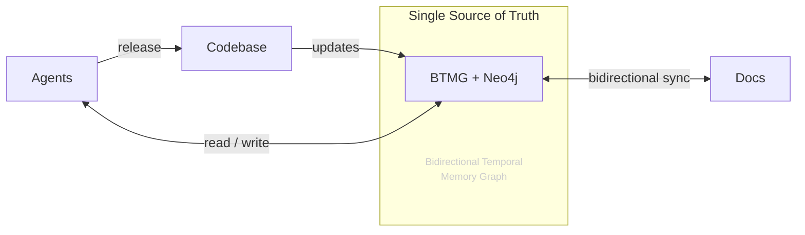

## The Problem

Modern AI-assisted development introduces a persistent coordination failure: agents lose context between sessions, documentation drifts from the actual state of the codebase, and there is no shared memory that both humans and agents can trust.

The result is agents that hallucinate stale facts, documentation that no one updates, and no reliable way to know what the system actually looked like at any point in time.

## What BTMG Does

BTMG solves this by treating your knowledge graph as the authoritative record — not your docs, not your agent's context window, not a wiki that someone forgot to update.

**Single source of truth.** All entities, relationships, and decisions live in a Neo4j graph. Documentation and agents read from and write to the same store.

**Bitemporal versioning.** Every entity carries two time dimensions: when a fact was valid in the real world, and when it was recorded. You can query what the system looked like at any past moment, not just the current state.

**Schema-enforced mutations.** All writes go through Zod schemas. Agents cannot write malformed or contradictory data. This is the primary anti-hallucination mechanism.

**Bidirectional sync.** The graph syncs to and from MD/MDX files. Documentation is generated from the graph, and structured content in docs can be pushed back into the graph. Neither side is the source — the graph is.

**Audit trail.** Every mutation is recorded with timestamps, author, and reason. You always know who wrote what and when.

## Architecture

The codebase pushes updates into BTMG as entities and relationships change. Agents read from the graph to stay grounded in current facts, and write back decisions, observations, and state changes. Documentation is generated from the graph and kept in sync bidirectionally. Agents can also trigger releases back to the codebase, closing the loop.

## What BTMG Provides

| Component | Description |
|---|---|
| Core API | TypeScript API for reading and writing entities with temporal versioning |
| CLI | Command-line interface for graph management and doc sync |
| MCP Server | Model Context Protocol server for AI agent integration |
| Zod Schemas | Schema definitions enforced on all mutations |

## Next Steps

- [Installation](/installation) — get BTMG running in your project
