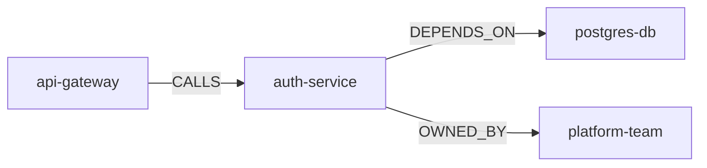

## How Bidirectional Sync Works

BTMG maintains a live connection between your Neo4j graph and a directory of Markdown files. The two representations are kept in sync using a content-hash-based diffing mechanism.

When BTMG renders graph state to docs, it writes a `_sync_hash` field into each file's frontmatter. This hash is a deterministic SHA1 of the entity's properties at the time of rendering. When you later edit that file directly, the hash no longer matches the computed hash of the stored graph state — this is how BTMG detects that a doc-side change has occurred.

The same mechanism works in reverse: when a node's properties change in Neo4j, BTMG computes a new hash and compares it against the one stored in the file. A mismatch signals a graph-side change.

## Sync Flow

Each sync run executes the following steps in order:

1. **Load graph state** — BTMG reads all nodes and relationships from Neo4j within the configured scope.
2. **Parse docs** — BTMG reads all `.md` files in the docs directory, extracting frontmatter and body content.
3. **Compute changes** — For each entity, BTMG compares the stored `_sync_hash` against the computed hash of current properties. Changes are classified as graph-side, doc-side, or conflicting.
4. **Resolve conflicts** — Any entity with both graph-side and doc-side changes is handled according to the configured conflict strategy.
5. **Apply changes** — Resolved changes are written back to Neo4j (for doc-side edits) or to the filesystem (for graph-side edits).
6. **Re-render docs** — Updated files are written with refreshed frontmatter and auto-generated Mermaid diagrams showing relationships to other entities.

## Conflict Detection

A conflict occurs when the same entity has been modified both in the graph and in the doc since the last sync. BTMG detects this by checking:

- Whether the `_sync_hash` in the file differs from a freshly computed hash of the file's own properties (doc-side change).
- Whether the `_sync_hash` in the file differs from the hash of the current graph node's properties (graph-side change).

If both conditions are true simultaneously, the entity is in conflict.

The `_sync_hash` is computed as a deterministic SHA1 hash of the entity's user-defined properties, sorted by key. System fields (`_id`, `_label`, `_version`, `_sync_hash`) are excluded from the hash input so that versioning metadata does not cause spurious conflicts.

## Conflict Strategies

Configure the conflict strategy in `btmg.config.ts` under the `sync.conflictStrategy` key, or pass it at the command line with `--strategy`.

| Strategy | Behavior |
|---|---|
| `graph-wins` | Graph state is authoritative. Doc-side changes are overwritten. This is the default. |
| `docs-wins` | Doc content is authoritative. Graph is updated to match the file. |
| `merge` | BTMG attempts a property-level merge, taking the most recent value for each key based on `_version`. Conflicts at the property level cause the run to fail. |
| `fail` | Any conflict causes the sync to abort immediately with a non-zero exit code. Use this in CI to enforce manual resolution. |

## Doc File Format

Each entity is rendered to a single Markdown file. The filename follows the pattern `{_label}/{_id}.md`, for example `Service/auth-service.md`.

### Frontmatter

The frontmatter contains all system fields and all user-defined properties from the graph node:

```yaml
---
_id: auth-service
_label: Service
_sync_hash: a3f8b2c1d4e5...
_version: 7
name: Auth Service
status: active
owner: platform-team
description: Handles authentication and session management.
---
```

System fields begin with an underscore. All other fields are user properties stored directly on the Neo4j node.

### Body Content

The body of each file contains two sections:

1. **Content** — Free-form Markdown that you write and edit. This content is stored on the node as a `_content` property in Neo4j and round-tripped faithfully.
2. **Relationships diagram** — An auto-generated Mermaid diagram appended at the end of the file, reflecting the node's current relationships in the graph.

```md
## Relationships


```

The relationships section is regenerated on every sync and should not be edited manually — changes will be overwritten.

## File Structure

BTMG organises rendered files by label:

```
docs/
  Service/
    auth-service.md
    payment-service.md
  Team/
    platform-team.md
    data-team.md
  Database/
    postgres-db.md
```

The directory structure is derived from node labels. If a node has multiple labels, BTMG uses the first label alphabetically unless a `primaryLabel` is configured in `btmg.config.ts`.
