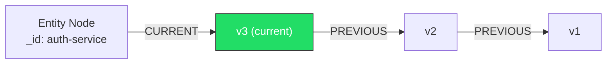

## The Problem with Mutable State

Most databases store the current value of a thing. When you update a record, the old value is gone. This is fine for applications that only care about now, but it creates two problems for a knowledge graph used by both humans and agents:

1. You cannot ask "what did this service look like last Tuesday before the deployment?"
2. You cannot prove that a decision was made based on accurate information at the time it was made.

BTMG solves this with a bitemporal model. Every entity carries two time dimensions: when a fact was valid in the real world, and when it was recorded in the graph. These are tracked independently, so you can reconstruct the exact state of your knowledge at any past moment.

---

## Entity-State Pattern

Rather than storing mutable properties directly on an entity node, BTMG separates identity from state.

### Entity Node

An Entity node represents the persistent identity of a thing. Its properties are immutable once created.

| Property | Type | Description |
|---|---|---|
| `_id` | `string` | A stable, globally unique identifier. Never changes. |
| `_label` | `string` | The schema label (e.g. `"Service"`, `"Team"`). |
| `_created_at` | `DateTime` | When this entity was first recorded. Never changes. |

Entity nodes carry no mutable business properties. Those live exclusively in State nodes.

### State Node

A State node holds the properties of an entity at a specific point in time. Every mutation creates a new State node rather than overwriting the previous one.

| Property | Type | Description |
|---|---|---|
| `_valid_from` | `DateTime` | When this state became true in the real world. |
| `_valid_to` | `DateTime \| null` | When this state ceased to be true. `null` means currently valid. |
| `_recorded_at` | `DateTime` | When this state was written into the graph. |
| `_version` | `number` | Monotonically increasing version counter, starting at `1`. |
| `_actor` | `string` | Identifier of who or what created this state (user, agent ID, system). |

In addition to these system properties, a State node carries all the business properties defined for its label in the schema — `name`, `status`, `port`, and so on.

---

## Relationships

### `CURRENT`

The Entity node always has exactly one `CURRENT` relationship pointing to its latest State node. This is how you read the present value of any entity without reasoning about versions.

```cypher
MATCH (e:Service {_id: $id})-[:CURRENT]->(s)
RETURN e, s
```

When a new state is created, BTMG atomically removes the old `CURRENT` relationship and creates a new one pointing to the new State node.

### `PREVIOUS`

Each State node (except the first) has a `PREVIOUS` relationship pointing to the State node that preceded it. This forms a linked chain of the full version history, ordered newest to oldest.

```cypher
MATCH (e:Service {_id: $id})-[:CURRENT]->(latest)-[:PREVIOUS*]->(old)
RETURN old ORDER BY old._version DESC
```

---

## Version Chain Diagram



The Entity node is stable. The `CURRENT` pointer always moves forward to the newest State. The `PREVIOUS` chain preserves the full history.

---

## Time-Travel Queries

### `getAt(id, timestamp)`

Returns the State node that was valid for a given entity at a specific point in time.

```ts
const state = await btmg.getAt('auth-service', new Date('2025-11-01T09:00:00Z'));
// Returns the State node where:
//   _valid_from <= 2025-11-01T09:00:00Z
//   AND (_valid_to > 2025-11-01T09:00:00Z OR _valid_to IS NULL)
```

This resolves against valid time — when the fact was true in the real world — not when it was recorded. If you need to query by recorded time instead, use `getRecordedAt(id, timestamp)`.

The underlying Cypher:

```cypher
MATCH (e {_id: $id})-[:CURRENT|PREVIOUS*]->(s)
WHERE s._valid_from <= $timestamp
  AND (s._valid_to > $timestamp OR s._valid_to IS NULL)
RETURN s
ORDER BY s._version DESC
LIMIT 1
```

### Full History

```ts
const history = await btmg.getHistory('auth-service');
// Returns all State nodes for this entity, ordered by version ascending
```

---

## Audit Trail

Every mutation that passes schema validation creates an `AuditEntry` node alongside the new State node. AuditEntry nodes are append-only and are never modified.

| Property | Type | Description |
|---|---|---|
| `_id` | `string` | Unique identifier for this audit entry. |
| `entity_id` | `string` | The `_id` of the entity that was mutated. |
| `actor` | `string` | Who or what performed the mutation. |
| `timestamp` | `DateTime` | When the mutation was recorded. |
| `action` | `string` | One of `"create"`, `"update"`, `"delete"`. |
| `changes` | `json` | Diff of what changed: `{ field: { from, to } }`. |
| `version_from` | `number \| null` | Previous version number. `null` for creates. |
| `version_to` | `number` | New version number created by this mutation. |

```ts
const audit = await btmg.getAuditTrail('auth-service');
// Returns all AuditEntry nodes for this entity, ordered by timestamp ascending
```

Example `changes` diff:

```json
{
  "status": { "from": "running", "to": "degraded" },
  "port":   { "from": 8080,      "to": 9090 }
}
```

The audit trail answers two questions that are otherwise impossible to answer reliably: what changed, and who changed it.

---

## Snapshots

A snapshot reconstructs the entire graph — all entities and their valid states — at a specific point in time.

```ts
const snapshot = await btmg.snapshot(new Date('2025-10-15T00:00:00Z'));
// Returns every entity with the State that was valid at that timestamp
```

Snapshots are computed from the version chain, not stored separately. You can generate a snapshot at any timestamp without having set it up in advance.

This is useful for:

- Debugging: reproduce the exact graph state that an agent was working with during an incident
- Audits: demonstrate what the system looked like at a contractually relevant moment
- Diffing: compare two snapshots to understand what changed between any two points in time

---

## Soft Deletes

Deleting an entity in BTMG does not remove anything from the graph. Instead, the current State node's `_valid_to` is set to the deletion timestamp, and a new `AuditEntry` is created with `action: "delete"`.

```ts
await btmg.delete('auth-service', { actor: 'seb', reason: 'service decommissioned' });
```

After a soft delete:

- The entity is excluded from all default read queries
- The full history and audit trail remain intact
- Time-travel queries to timestamps before the deletion still resolve correctly
- The entity can be restored by creating a new State node with `_valid_from` set to the restoration timestamp

To query deleted entities explicitly:

```ts
const deleted = await btmg.find('Service', { includeDeleted: true });
```

The entity and its entire timeline are preserved. Nothing is ever overwritten.
